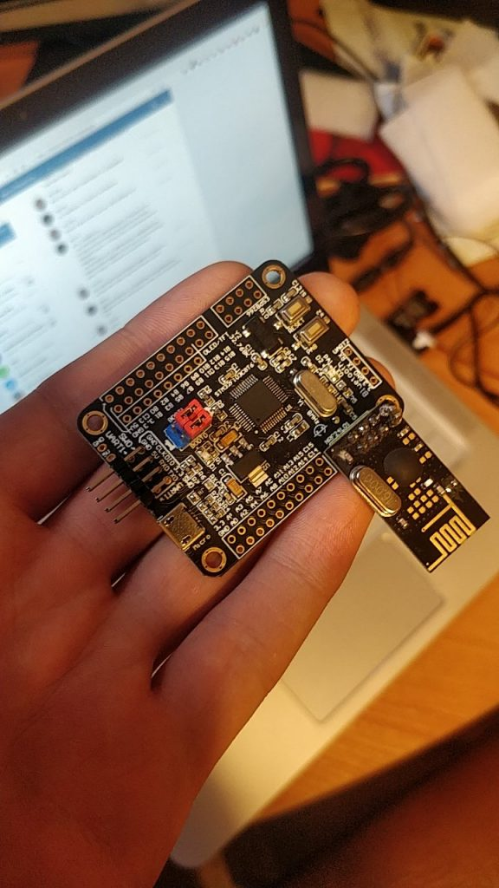

# Wut is it? 

This is a simple project of a usb-connected MySensors gateway based on cheap STM32 dev board from AliExpress.



# Instructions

## Burn the bootloader. 

Check out dapboot/ directory for a prebuilt one. Flash it with stm32flash or stlink to your board.

The sources are here: https://github.com/devanlai/dapboot
Patch them with dapboot.patch that alters the bluepill board target.

# Compile the gateway
* Install the platformio, RTFM: https://platformio.org/install
* Clone this repository 
* Edit src/config.h to suit your needs 
* Connect the board via usb and run `pio run -t upload`
* REMOVE BOOT1 JUMPER AWAY FROM THE BOARD (OR RADIO WILL NOT WORK!)

Your gateway is ready to use. Enjoy.

## Install udev rules

Copy 99-mysensors.rules to /etc/udev/rules.d and run

```
udevadm control --reload-rules
udevadm trigger
```

With these rules intact, udev will make the board always switch to the gateway mode. Disable rules if you are manually hacking something.

# Statistics

The gateway provides the following sensors and switches: 

- 0 - Overall RX packets
- 1 - 10 Minutes RX packets
- 2 - Min. packet interval RX, ms
- 3 - Max. packet interval RX, ms
- 4 - Avg. packet interval RX, ms
- 5 - Overall TX packets
- 6 - 10 Minutes TX packets
- 7 - Min. packet interval TX
- 8 - Max. packet interval TX
- 9 - Avg. packet interval TX
- 10 - Virtual switch. Turn on to reboot to bootloader.
- 11 - Virtual switch. Turn on to reboot the gateway (skipping the bootloader)

To display statistics in two HomeAssistant cards, add the following cards to your LoveLace UI. 
The statistics give you an overview of your network traffic and can aid in managing your network

* For RX

```yaml
cards:
  - entity: sensor.the_ancient_gateway_0_0
    name: Total RX
    type: entity
    unit: packets
  - entity: sensor.the_ancient_gateway_0_1
    graph: line
    name: RX in last 10 minutes
    type: sensor
  - entity: sensor.the_ancient_gateway_0_2
    name: Minimum inter-packet interval
    type: entity
    unit: ms
  - entity: sensor.the_ancient_gateway_0_3
    name: Maximum inter-packet interval
    type: entity
    unit: ms
  - entity: sensor.the_ancient_gateway_0_4
    name: Minimum inter-packet interval
    type: entity
    unit: ms
  - entity: switch.the_ancient_gateway_0_11
    name: Reboot Gateway
    type: entity
type: vertical-stack

```

* For TX

```yaml
cards:
  - entity: sensor.the_ancient_gateway_0_5
    name: Total TX
    type: entity
    unit: packets
  - entity: sensor.the_ancient_gateway_0_6
    graph: line
    name: TX in last 10 minutes
    type: sensor
  - entity: sensor.the_ancient_gateway_0_7
    name: Minimum inter-packet interval
    type: entity
    unit: ms
  - entity: sensor.the_ancient_gateway_0_8
    name: Maximum inter-packet interval
    type: entity
    unit: ms
  - entity: sensor.the_ancient_gateway_0_9
    name: Minimum inter-packet interval
    type: entity
    unit: ms
  - entity: switch.the_ancient_gateway_0_10
    name: Reboot to Bootloader
    type: entity
type: vertical-stack
```


# About

Created for fun by Andrew 'Necromant' Andrianov. 
Check out my blog: http://ncrmnt.org
Especially this post with pictures about the board: 

If you liked this small hack and you want to buy me a coffee - you're welcome:
